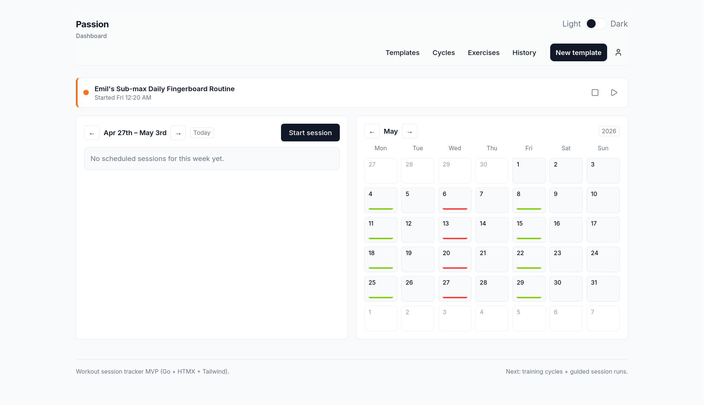
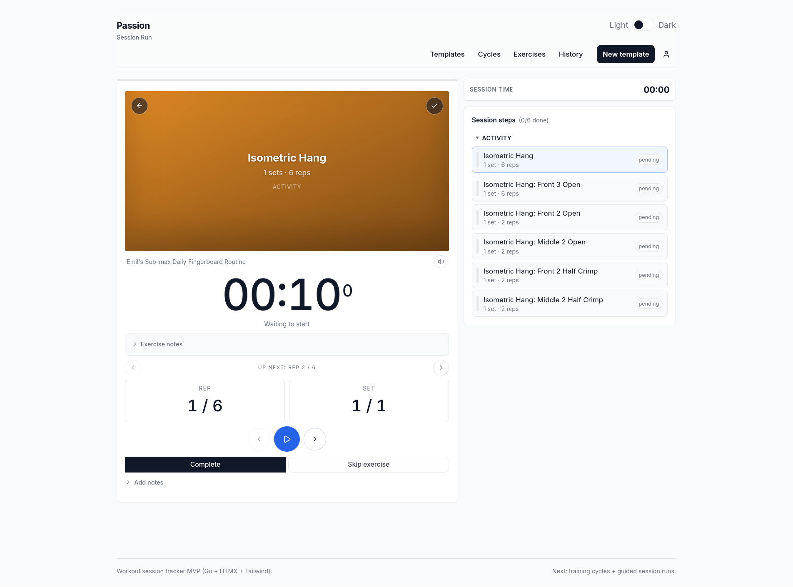
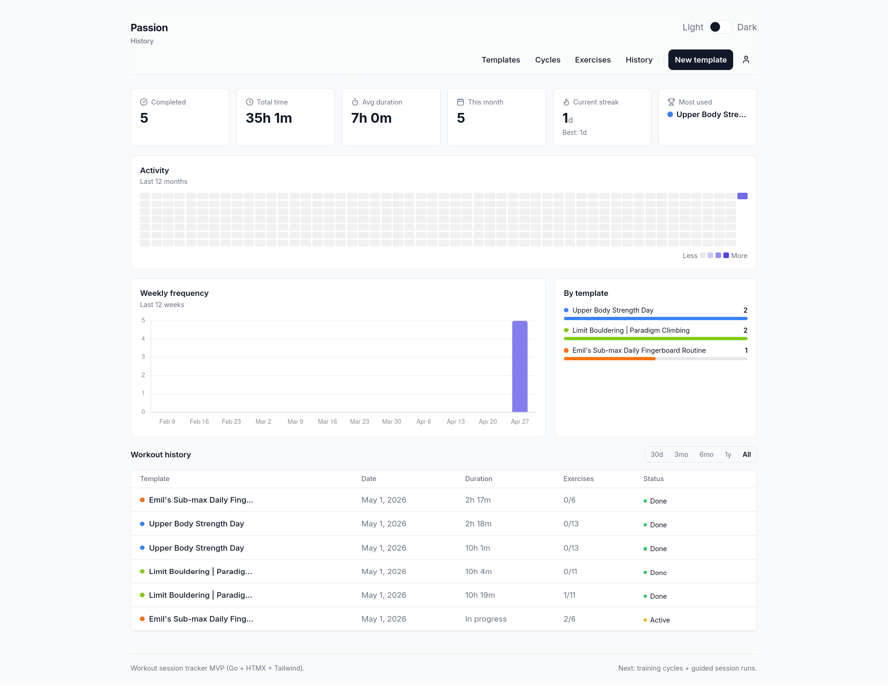
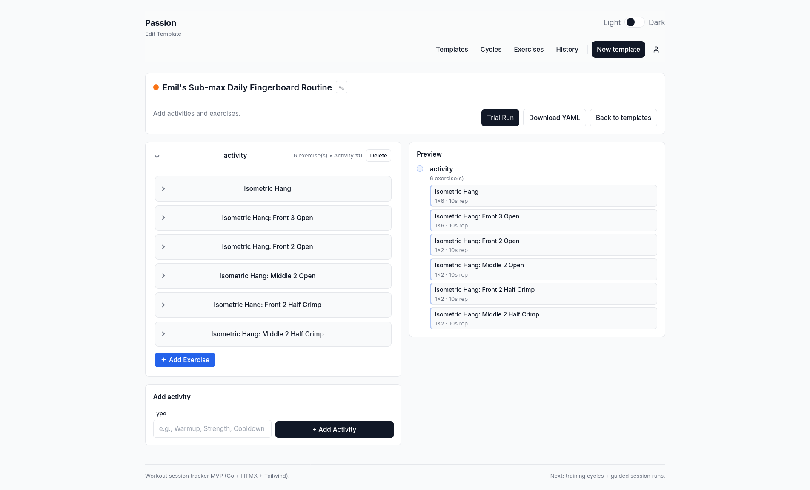
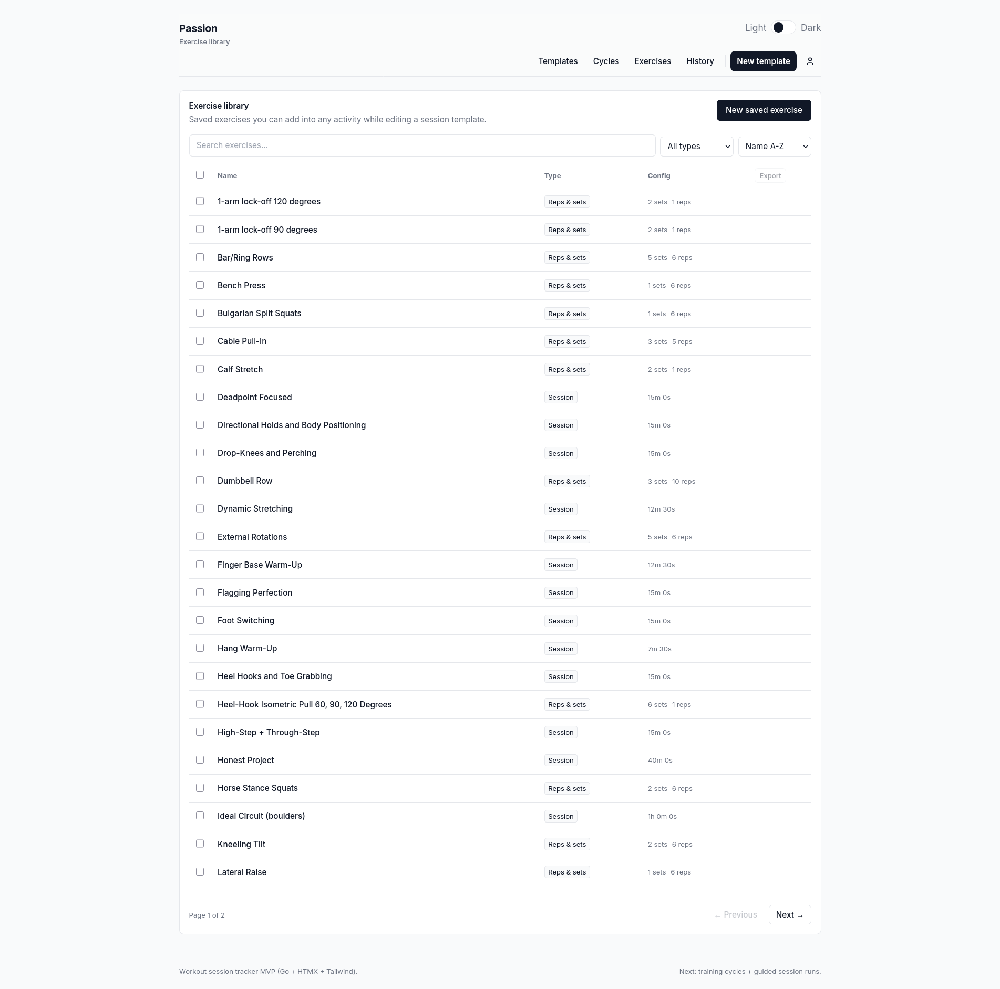

<p align="center">
  <strong>Passion</strong><br>
  <sub>A structured climbing training app built with Go, HTMX, and SQLite.</sub>
</p>

<p align="center">
  
  
  
  
</p>

---

<!-- SCREENSHOT: dashboard with a week of scheduled sessions and the month calendar visible -->
<!-- Replace the placeholder below with your actual screenshot -->


---

## What it does

Passion helps you plan, schedule, and track climbing training sessions. Build session templates from a library of exercises, organize them into multi-week training cycles, and follow guided workout runs with built-in timers.

**Core features:**

- Session templates with warmup / activity / cooldown structure
- Exercise library with Markdown notes, sets/reps/timers, and embedded video
- Training cycles that auto-generate weekly schedules
- Guided run player with countdown timers, rep tracking, completion logging, and climbing tick logging (grade chip strip, outcome quick-actions, live session header)
- Training history with heatmaps, streak tracking, per-template breakdowns, and climbing analytics (grade pyramids, hardest-sent, send rate)
- Weekly + monthly calendar dashboard
- YAML-driven exercise and template catalog for version-controlled training plans
- Multi-user auth (JWT) with in-app password change, dark/light theme, fully server-rendered with HTMX

---

## Screenshots

<!-- Take these screenshots and drop them into docs/screenshots/ -->

### Dashboard


### Guided Run



### History



### Template Editor



### Exercise Library



<!-- SCREENSHOTS TO TAKE:
  1. docs/screenshots/dashboard.png    — Dashboard with a populated week (sessions scheduled, month calendar showing colored dots)
  2. docs/screenshots/run.png          — Guided run mid-workout (timer counting, exercise card visible, playlist sidebar open)
  3. docs/screenshots/history.png      — History page with some completed workouts (heatmap, weekly chart, table with data)
  4. docs/screenshots/template-edit.png — Template editor with a few activities expanded showing exercises
  5. docs/screenshots/exercise-library.png — Exercise library grid with a few entries
  Use dark mode for all screenshots for the best contrast on GitHub's dark default.
  Resize your browser to ~1200px wide for consistent framing.
-->

---

## Quick start

```sh
# Clone and run
git clone https://github.com/<you>/passion.git
cd passion
make watch        # hot-reload dev server at :3000
```

Sign up at `/signup`. For faster local dev, skip auth entirely and load demo data:

```sh
PASSION_SEED=1 PASSION_DEV_AUTH_BYPASS=1 make run
```

---

## Configuration

Copy [`passion.example.yaml`](passion.example.yaml) to `passion.yaml` or configure via environment variables. Env vars always override the YAML file.

| Variable | Default | Description |
|---|---|---|
| `PASSION_ADDR` | `:3000` | Listen address |
| `PASSION_DB_PATH` | `passion.db` | SQLite database path |
| `PASSION_JWT_SECRET` | `change-me-in-production` | JWT signing secret — **change this in production** |
| `PASSION_JWT_TTL_HOURS` | `168` | Token lifetime in hours (7 days) |
| `PASSION_SEED` | off | Populate demo data on empty DB |
| `PASSION_DEV_AUTH_BYPASS` | off | Auto-login as user 1 (dev only) |
| `PASSION_YAML_IMPORT_ENABLED` | off | Import catalog YAML at startup |
| `PASSION_YAML_EXERCISES_DIR` | `catalog/exercises` | Exercise YAML directory |
| `PASSION_YAML_SESSION_TEMPLATES_DIR` | `catalog/session_templates` | Session template YAML directory |
| `PASSION_YAML_ACTIVITY_TEMPLATES_DIR` | `catalog/activity_templates` | Activity template YAML directory |
| `PASSION_YAML_IMPORT_OWNER_ID` | `1` | Owner ID for imported records |

Pass `1`, `true`, `yes`, or `on` for boolean flags.

---

## YAML catalog

Training plans live in version-controlled YAML files under `catalog/`. On startup (when import is enabled), Passion upserts exercises and templates by name per owner.

<details>
<summary>Exercise example</summary>

```yaml
# catalog/exercises/pullups.yaml
name: "Weighted Pull-ups"
source: "Power Company Climbing"   # optional: program or coach it comes from
label: "strength, pulling"          # optional: comma-separated tags shown as chips
kind: "reps_and_sets"
sets: 5
reps: 5
rep_seconds: 5
set_rest_seconds: 120
weight_kg: 10
notes: "Controlled tempo"
```

</details>

<details>
<summary>Session template example</summary>

```yaml
# catalog/session_templates/strength_base.yaml
name: "Strength Base Session"
source: "Power Company Climbing"   # optional: program or coach it comes from
label: "strength, bouldering"       # optional: comma-separated tags shown as chips
color: "#ef4444"
activities:
  - type: "warmup"
    exercises:
      - name: "Row + Band Prep"
        sets: 2
        reps: 12
        rep_seconds: 4
        rep_rest_seconds: 30
        set_rest_seconds: 30
  - type: "activity"
    exercises:
      - ref: "Weighted Pull-ups"    # references a library exercise by name
      - name: "Ring Rows"
        sets: 4
        reps: 10
        rep_seconds: 4
        set_rest_seconds: 90
```

</details>

Import behavior:

- Runs on startup only when `PASSION_YAML_IMPORT_ENABLED` is set
- Upserts by `owner_id + name` — safe to re-run
- Template updates replace activities/exercises to preserve ordering
- Unknown `ref` or invalid YAML fails startup fast

---

## Project structure

```
cmd/passion/           Entry point — config loading, DB init, server startup
config/                12-factor config (YAML + env vars)
db/                    GORM models, SQLite store, seed data, YAML importer
http/server/           Chi router, all HTTP handlers, middleware
pages/                 Compiles and renders all Go HTML templates
templates/             Go HTML templates — pages, fragments, layouts
static/                CSS, JS (HTMX, Tailwind, Lucide), icons
catalog/               YAML exercise and template definitions
docs/                  Screenshots and documentation
scripts/               Utility scripts
```

---

## Developer guide

See [docs/DEVELOPMENT.md](docs/DEVELOPMENT.md).

---

## License

Personal project. Not currently licensed for redistribution.
